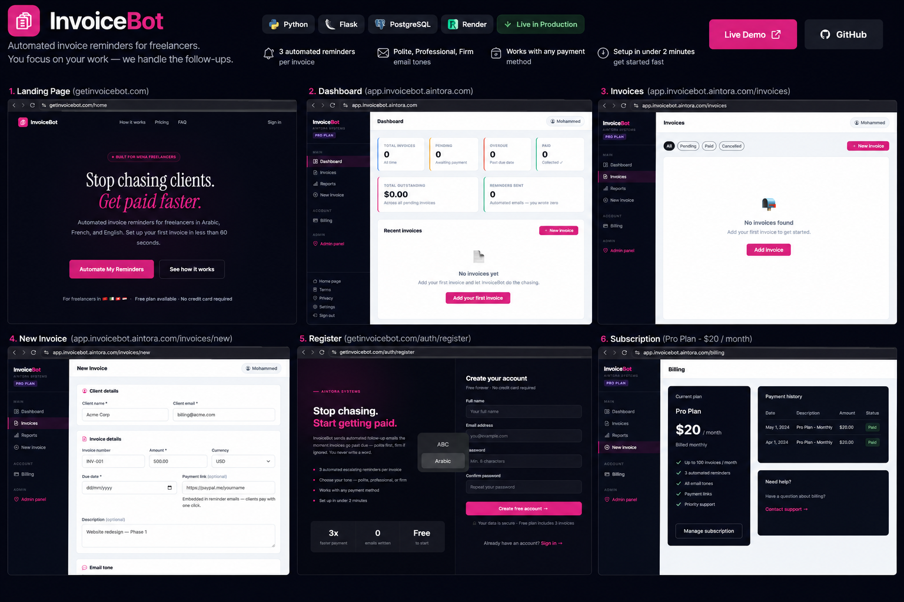

# InvoiceBot

> **Automated invoice payment reminders for freelancers and small businesses.**  
> Add invoices, schedule multi-stage reminder emails, manage clients, and keep overdue payments moving — without writing a single follow-up manually.

[](https://getinvoicebot.com)
[](#tech-stack)
[](https://render.com)
[](#license)

---

## What is InvoiceBot?

InvoiceBot is a production SaaS application that automates invoice follow-up for freelancers who work directly with clients — without the overhead of enterprise invoicing tools or the chaos of writing reminder emails manually.

A user adds an invoice, sets a due date and tone, and InvoiceBot handles the rest: scheduling and sending 3 escalating reminder emails (polite → professional → firm) in the client's language. The user marks invoices as paid when payment arrives.

**Built for MENA freelancers.** Email reminders support Arabic, French, and English — a deliberate product decision to serve the underserved Moroccan and MENA freelance market where no such localized tooling exists.

---

## Product Showcase

### Full Application Overview



> A full overview of the production application: landing page, dashboard, invoice management, invoice creation, registration, and subscription billing — all live at [getinvoicebot.com](https://getinvoicebot.com).

---

### 1 — Landing Page · `getinvoicebot.com`

The public-facing landing page communicates the core value proposition to freelancers in under 5 seconds: stop writing follow-up emails, get paid faster. Highlights the free plan, multi-language support, and a sub-60-second setup time.

---

### 2 — Registration · `getinvoicebot.com/auth/register`

Clean, frictionless signup flow. No credit card required. The free plan allows 3 active invoices and full access to email reminders, making it genuinely useful before asking for payment.

---

### 3 — Dashboard · `app.invoicebot.aintora.com`

The authenticated dashboard gives users a real-time overview of total invoices, pending amounts, overdue counts, collected revenue, and reminders sent. New users see an onboarding checklist that guides them through setup (company name → default payment link → first invoice). The checklist disappears once all three steps are complete.

---

### 4 — Invoice Management · `app.invoicebot.aintora.com/invoices`

A filterable invoice list (All / Pending / Paid / Cancelled) with status badges. Each invoice links to a detail page with a per-stage email preview, so users can see exactly what their clients will receive before the reminders go out.

---

### 5 — Create Invoice · `app.invoicebot.aintora.com/invoices/new`

Invoice creation form with client details (name, email), invoice metadata (number, amount, currency, due date), an optional payment link embedded in reminder emails, and an email tone selector (Polite / Professional / Firm). Once created, the reminder schedule is set automatically.

---

### 6 — Subscription & Billing · `app.invoicebot.aintora.com/billing`

The billing page shows the user's current plan, monthly cost, payment history, and plan features. Upgrades are handled through Lemon Squeezy checkout. Webhooks automatically update the user's plan on the backend upon a successful subscription event.

---

## Features

**Invoice management**
- Create invoices with client email, amount, currency, due date, tone, and optional payment link
- Per-invoice email preview across all 3 reminder stages before they send
- Mark invoices as paid manually; status updates immediately
- Invoice report with total invoiced, collected, pending, and overdue amounts
- Per-client revenue breakdown

**Automated reminders**
- 3 scheduled reminder emails per invoice (sent via APScheduler background jobs)
- Configurable tone per invoice: `polite`, `professional`, `firm`
- Multi-language support per user account: English, French, Arabic
- Email logs with delivery success/failure per reminder

**User accounts**
- Registration, login, password reset
- User settings: company name, default payment link, email language
- Welcome email on signup
- Onboarding checklist for new users

**Billing & plans**
- Free plan: 3 active invoices, no credit card required
- Starter ($10/month): up to 20 invoices + CSV export
- Pro ($20/month): unlimited invoices + CSV export + PDF report
- Lemon Squeezy webhook integration for automatic plan upgrades

**Reporting & export**
- Invoice report page with summary stats and per-client breakdown
- CSV export (Starter plan and above)
- PDF report export (Pro plan)

**Production quality**
- Flask-Talisman security hardening (HTTPS, CSP, HSTS)
- Custom error pages for 403, 404, and 500
- Admin panel for blocked user management and email log monitoring
- Debug email route for verifying delivery in production

---

## Tech Stack

| Layer | Technology |
|---|---|
| Backend | Python 3.12, Flask 3 |
| Database | PostgreSQL, SQLAlchemy, Flask-Migrate |
| Auth | Flask-Login, Flask-WTF |
| Background Jobs | APScheduler |
| Email Delivery | Brevo (HTTP API / SMTP relay) |
| Payments | Lemon Squeezy (webhooks) |
| Frontend | Vite, React 18, Tailwind CSS v4, shadcn/ui, Framer Motion |
| Deployment | Render (app server + managed PostgreSQL) |
| Security | Flask-Talisman (HTTPS, CSP, HSTS, X-Frame-Options) |

---

## Architecture

```
Client (Browser)
    │
    ├── React SPA (Vite build → app/static/react/)
    │       Served at /app/  via Flask static file handler
    │
    └── Flask Application (Gunicorn on Render)
            │
            ├── Auth          /auth/*
            ├── Dashboard     /dashboard/* → redirects to /app/
            ├── Invoices      /invoices/*
            ├── Billing       /billing/*
            ├── Admin         /admin/*
            │
            ├── APScheduler   Background job: checks and sends due reminder emails
            │
            ├── Brevo         Transactional email delivery (SMTP relay)
            ├── Lemon Squeezy Checkout + webhook → plan update
            │
            └── PostgreSQL    Users, Invoices, EmailSchedule, EmailLog
```

**Email scheduling flow:**
1. User creates an invoice with a due date.
2. The app computes 3 reminder send times relative to the due date.
3. APScheduler runs on a recurring interval and queries `EmailSchedule` for due reminders.
4. Due reminders are rendered in the user's language and tone, then sent via Brevo.
5. Delivery result is written to `EmailLog`.

---

## Folder Structure

```
invoicebot/
├── app/
│   ├── __init__.py          # App factory, extensions, error handlers, scheduler bootstrap
│   ├── models.py            # User, Invoice, EmailSchedule, EmailLog models
│   ├── auth/                # Registration, login, password reset, settings
│   ├── billing/             # Lemon Squeezy checkout and webhook handling
│   ├── dashboard/           # Authenticated dashboard, onboarding checklist
│   ├── invoices/            # Invoice CRUD, email preview, report, CSV/PDF export
│   ├── email_service/       # Email templates (EN/FR/AR), send logic, welcome email
│   ├── scheduler/           # APScheduler job for processing due reminder emails
│   ├── templates/           # Jinja2 views and custom error pages
│   └── static/              # CSS/JS assets and React build output
├── config.py                # App configuration, environment settings, plan limits
├── init_db.py               # Database initialization script
├── run.py                   # Local development entry point
├── seed.py                  # Development data seeder
├── requirements.txt         # Python dependencies
├── Procfile                 # Gunicorn process definition for Render/Heroku
└── .env.example             # Required environment variables reference
```

---

## Database Models

| Model | Purpose |
|---|---|
| `User` | Account, plan, settings (language, company, payment link) |
| `Invoice` | Client info, amount, due date, tone, status |
| `EmailSchedule` | Three scheduled send times per invoice with sent/failed state |
| `EmailLog` | Delivery record per reminder: provider response, timestamp, success flag |

---

## Local Setup

### 1. Clone the repository

```bash
git clone https://github.com/Mohammed18-19/invoicebot.git
cd invoicebot
```

### 2. Create a virtual environment

```bash
python -m venv venv
source venv/bin/activate
pip install -r requirements.txt
```

### 3. Configure environment variables

```bash
cp .env.example .env
```

**Required variables:**

| Variable | Description |
|---|---|
| `SECRET_KEY` | Strong random secret for Flask sessions |
| `DATABASE_URL` | PostgreSQL connection string |
| `MAIL_SERVER` | SMTP host (e.g. `smtp-relay.brevo.com`) |
| `MAIL_PORT` | SMTP port (e.g. `587`) |
| `MAIL_USE_TLS` | `True` for Brevo |
| `MAIL_USERNAME` | SMTP username |
| `MAIL_PASSWORD` | SMTP password / API key |
| `MAIL_FROM` | Sender email address |
| `MAIL_FROM_NAME` | Sender display name |
| `EMAIL_MODE` | `smtp` / `resend` / `db` / `test` |
| `LS_WEBHOOK_SECRET` | Lemon Squeezy webhook signature secret |
| `LS_STARTER_URL` | Lemon Squeezy Starter plan checkout URL |
| `LS_PRO_URL` | Lemon Squeezy Pro plan checkout URL |
| `APP_URL` | Public base URL (e.g. `http://localhost:5000`) |
| `FLASK_ENV` | `development` or `production` |

### 4. Initialize the database

```bash
python init_db.py
```

Or via Flask-Migrate:

```bash
flask db init
flask db migrate -m "initial schema"
flask db upgrade
```

### 5. Seed demo data (optional)

```bash
python seed.py
```

### 6. Run the development server

```bash
python run.py
```

Open `http://localhost:5000`.

---

## Email Configuration

### Brevo (recommended for production)

Brevo provides 300 free emails/day with proper SPF/DKIM setup, which significantly improves inbox delivery rates compared to generic SMTP.

```env
MAIL_SERVER=smtp-relay.brevo.com
MAIL_PORT=587
MAIL_USE_TLS=True
MAIL_USE_SSL=False
MAIL_USERNAME=your_brevo_login@smtp-brevo.com
MAIL_PASSWORD=your_brevo_smtp_key
MAIL_FROM=yourapp@yourdomain.com
MAIL_FROM_NAME=InvoiceBot
EMAIL_MODE=smtp
```

### Email modes

| Mode | Behavior |
|---|---|
| `smtp` | Sends via configured SMTP provider |
| `resend` | Sends via Resend API (3,000 free emails/month) |
| `db` | Stores email drafts in database without sending |
| `test` | Logs email content to terminal only |

### Verify email delivery in production

```
GET /debug/test-email
```

Returns a JSON response with `success`, `provider`, `error`, and active configuration details.

---

## Deployment

The app is deployed on **Render** using a standard Gunicorn `Procfile`. The database is a Render-managed PostgreSQL instance.

### Steps

1. Push code to GitHub.
2. Connect the repository to Render.
3. Add all environment variables from `.env.example` in the Render dashboard.
4. Run database migrations via the Render shell:
   ```bash
   flask db upgrade
   ```
5. Deploy.

**Critical production variables:**

```env
FLASK_ENV=production
SECRET_KEY=<strong-random-secret>
DATABASE_URL=<render-postgres-url>
APP_URL=https://yourdomain.com
```

> Note: This project was previously deployed on Railway and migrated to Render. Railway is no longer used.

---

## Plan Limits

| Feature | Free | Starter ($10/mo) | Pro ($20/mo) |
|---|---|---|---|
| Active invoices | 3 | 20 | Unlimited |
| Automated email reminders | ✓ | ✓ | ✓ |
| All email tones | ✓ | ✓ | ✓ |
| CSV export | ✗ | ✓ | ✓ |
| PDF report export | ✗ | ✗ | ✓ |

Plans are managed via Lemon Squeezy webhooks. The webhook handler reads the `product_name` field from the event payload to determine which plan to activate.

---

## Multi-Language Reminders

Reminder language is set per user account in **Settings → Language**. All 3 reminder stages and all 3 tones are fully translated.

| Language | Code |
|---|---|
| English | `en` (default) |
| French | `fr` |
| Arabic | `ar` |

---

## Engineering Decisions

**Why APScheduler instead of Celery?**  
For a focused SaaS with predictable email volumes at this scale, APScheduler running in-process is sufficient and eliminates the operational overhead of a separate message broker (Redis/RabbitMQ). The scheduler queries `EmailSchedule` for due reminders on each tick and sends in batches.

**Why Brevo for email delivery?**  
Brevo provides free transactional email with proper SPF/DKIM authentication out of the box, which is the most impactful factor in avoiding spam folders. Gmail SMTP does not offer this for outgoing mail to third-party recipients.

**Why Lemon Squeezy instead of Stripe?**  
Lemon Squeezy acts as a Merchant of Record, handling VAT and international payment compliance automatically. This removes significant legal and accounting overhead for a solo-founder product.

**Why `product_name` for plan detection in webhooks?**  
Lemon Squeezy webhook payloads include both `variant_name` and `product_name`. Using `product_name` provides more stable plan detection since product names are less likely to change than variant names.

**Landing page is intentionally frozen.**  
After initial launch, further iteration on the landing page was deliberately paused to focus engineering and marketing energy on customer acquisition rather than design polish.

---

## Useful Commands

```bash
# Activate virtual environment
source venv/bin/activate

# Run locally
python run.py

# Reset and reinitialize the database
python init_db.py

# Seed development data
python seed.py

# Create and apply a migration
flask db migrate -m "description"
flask db upgrade

# List all registered routes
flask routes
```

---

## License

This project is released under a proprietary license. All rights are reserved by Mohammed.  
Unauthorized copying, distribution, or derivative use is prohibited without express written permission.

---

Built with Flask and PostgreSQL.  
**[Live Demo →](https://getinvoicebot.com)**